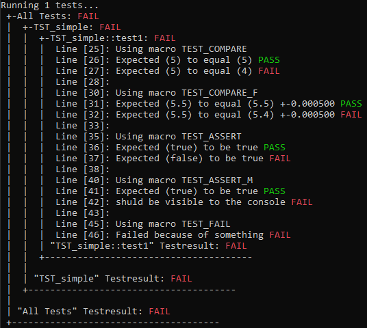

# UnitTest
## Table of content
- [Overview](#overview)
- [Hirarchy](#hirarchy)
- [Test class](#test-class)
- [Test function macros](#test-function-macros)
- [Run the test classes ](#run-the-test-classes)
--------------
## Overview
This is a simple unit test library.<br>
Test results will be printed to the console.<br>
## Hirarchy
Unit tests are splitted in multiple parts.<br>
The first layer is the unit test project with its executable.<br>
The second layer is the test class.<br>
The thirt layer is the test function inside the test class.<br>

A test class contains multiple test functions.<br>
A test application contains multiple test classes.<br>

-------
## Test class
The test class holds multiple test functions which are called in the same order as they are registered using the **ADD_TEST** macro.<br>
Only registered functions are called automaticly by the unit test engine.
``` c++
#include "UnitTest.h"

class TST_simple : public UnitTest::Test
{
	TEST_CLASS(TST_simple)      // [1]
public:
	TST_simple()
		: Test("TST_simple")    // [2]
	{
        // [3]
		ADD_TEST(TST_simple::test1);
	}
private:

	// Test function
	TEST_FUNCTION(test1)
	{
		TEST_START;             // [4]

		int a = 0;
		TEST_MESSAGE("is a == 0?");
		TEST_ASSERT(a == 0);
	}
};
TEST_INSTANTIATE(TST_simple);   // [5]
```
This is a simple test class with one test function.<br>
1. Test class declaration macro.<br>
2. Constructor of the base with the name of the test.<br>
3. Registering the test memberfunctions. All test cases must be added using this macro.<br>
    If a test function gets added multiple times, it is executed multiple times.<br>
4. Each test function starts with the **TEST_START** macro.<br>
5. Each test class needs a static instantiation to be available for the unittest enginge.<br>
    This is done using the **TEST_INSTANTIATE** macro.<br>


    
### Test function macros
Inside a test function macros can be used to generate fails on specific conditions.
- **TEST_COMPARE(a, b)**<br>
Compares a and b for equality. Fails if, a != b.
- **TEST_COMPARE_F(a, b, margin)**
Compares a and b for equality, taking a margin in to account.
Fails if abs(a - b) > abs(margin)
- **TEST_ASSERT(condition)**
Checks if the condition is true. Fails if condition != true.
- **TEST_ASSERT_M(condition, assertMessage)**
Same as TEST_ASSERT, but lets you specify the text that will be displayed on failure.
- **TEST_FAIL(assertMessage)**
Will fail and display the assertMessage to the console.
- **TEST_MESSAGE(msg)**
Will never fail, only prints a message to the console.

Here you can see an example test case for the macros:
``` c++
TEST_FUNCTION(test1)
{
	TEST_START;

	TEST_MESSAGE("Using macro TEST_COMPARE");
	TEST_COMPARE(5, 5); // passes
	TEST_COMPARE(5, 4); // fails
	TEST_MESSAGE("");

	TEST_MESSAGE("Using macro TEST_COMPARE_F");
	TEST_COMPARE_F(5.5, 5.5, 0.001); // passes
	TEST_COMPARE_F(5.5, 5.4, 0.001); // fails
	TEST_MESSAGE("");

	TEST_MESSAGE("Using macro TEST_ASSERT");
	TEST_ASSERT(true); // passes
	TEST_ASSERT(false); // fails
	TEST_MESSAGE("");

	TEST_MESSAGE("Using macro TEST_ASSERT_M");
	TEST_ASSERT_M(true, "shuld not be visible to the console"); // passes
	TEST_ASSERT_M(false, "shuld be visible to the console"); // fails
	TEST_MESSAGE("");

	TEST_MESSAGE("Using macro TEST_FAIL");
	TEST_FAIL("Failed because of something"); // fails		
}
```




-------
## Run the test classes 
``` c++
#include <iostream>
#include "UnitTest.h"

// Include test classes
#include "TST_simple.h"

int main(int argc, char* argv[])
{
	std::cout << "Running "<< UnitTest::Test::getTests().size() << " tests...\n";
	UnitTest::Test::TestResults results;    // Create a container that holds the test results
	UnitTest::Test::runAllTests(results);   // Runs all tests
	UnitTest::Test::printResults(results);  // Prints the testresult to the console

    return results.getSuccess();
}
```
The output of this test:


